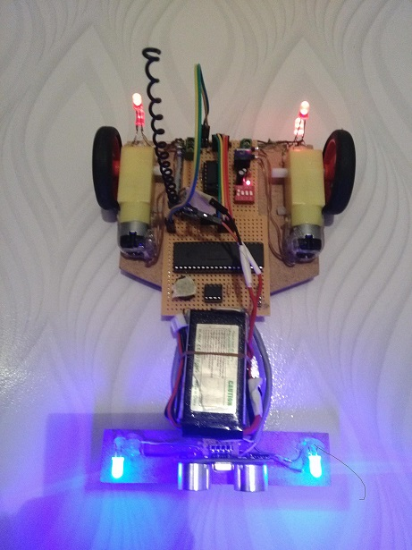

# RC Car
A Remote-controlled car is one of the basic projects in electronics. This project is useful for understanding RF communication and how to control an RC car.

### Car

### Remote Controller

## Components
### Transmitter (Remote Controller)
- 1x PIC16F877 Microcontroller
- 1x 433MHz Transmitter
- 1x Thumb Joystick (Direction)
- 1x 10k Potentiometer (Speed)
- 1x Button (Buzzer)
- 3x Switch (Power, Obstacle, and Lights)
- 1x 8MHz Crystal
- 1x 7805 Voltage Regulator
- 1x 8.4V 800mA (or which you have) LiPo Battery
- Others (Resistors, Capacitors, cables...)

### Receiver (Car)
- 1x PIC18F45K22 Microcontroller
- 1x PIC12F675 Microcontroller (for obstacle detection)
- 1x HC-SR04 Ultrasonic Sensor
- 1x 433MHz Receiver
- 2x DC Motor and Wheel
- 1x Ball Caster
- 1x Buzzer
- 4x 5mm LED
- 1x L293D Motor Driver
- 1x 11.1V 800mA (or which you have) LiPo Battery (for the receiver)
- 1x 7805 Voltage Regulator
- 1x Switch (Power)
- Others (Resistors, Capacitors, cables...)

## Communication Range
About 20m meters.
